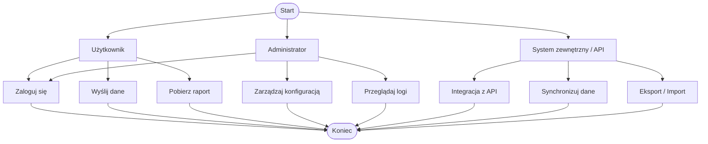

```mermaid
flowchart TD
    Start([Start])

    User[Użytkownik]
    Admin[Administrator]
    API[System zewnętrzny / API]

    Login[Zaloguj się]
    SendData[Wyślij dane]
    GetReport[Pobierz raport]

    Config[Zarządzaj konfiguracją]
    Logs[Przeglądaj logi]

    Integration[Integracja z API]
    Sync[Synchronizuj dane]
    ImportExport[Eksport / Import]

    End([Koniec])

    Start --> User
    Start --> Admin
    Start --> API

    User --> Login
    User --> SendData
    User --> GetReport

    Admin --> Login
    Admin --> Config
    Admin --> Logs

    API --> Integration
    API --> Sync
    API --> ImportExport

    Login --> End
    SendData --> End
    GetReport --> End
    Config --> End
    Logs --> End
    Integration --> End
    Sync --> End
    ImportExport --> End
```
